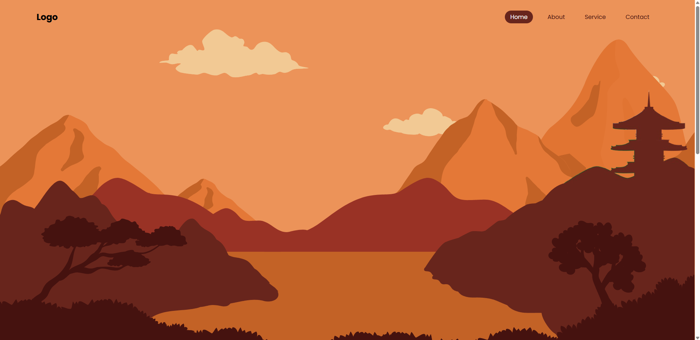
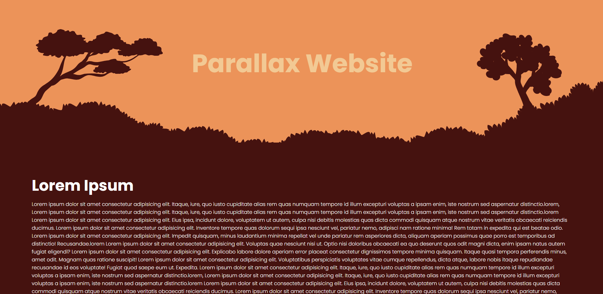

# Parallax Scrolling Website

This is a simple parallax scrolling website inspired by a tutorial from Codehal. It features a smooth parallax effect with layered images that move at different speeds as you scroll, creating a 3D depth illusion.

## 🚀 How to Use

1. **Clone or download** the repository.
2. Place all assets (HTML, CSS, JS, and images) in the same directory.
3. Open `index.html` in your browser to view the parallax effect in action.

## 🖼 Features

-   Smooth parallax scrolling
-   Basic navigation menu
-   Custom background imagery

## 🛠 Built With

-   HTML5
-   CSS3
-   Vanilla JavaScript
-   Canva For Images

## 📸 Preview

  
  

## 👨‍💻 Credits

- Tutorial Reference: [Codehal](https://youtu.be/kmM6mqvnxcs?si=ZfpqIC-TouYRm3uA)

## 📄 License

This project is open source and free to use for learning or personal projects.
